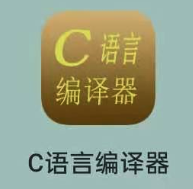

### 编程软件：

* VC6.0 或 VC2010 （推荐使用）
* 手机APP —— **C语言编译器**

### 作业要求：

1. 按题号顺序，逐题回答。

2. 编程题要有代码和输出结果。

3. 作业用A4纸打印，**课代表**收集好各班作业，课前并交给老师。

4. 附加分：排版较好的作业，额外给分。

   

### 第一次作业：

* 练习题2345
* **第5周**第一次课交回

