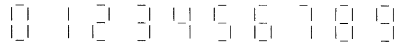

# 9. 数组

1. 斐波那契数为0, 1, 1, 2, 3, 5, 8, 13,…，其中每个数是其前面两个数的和。编写一个程序片段，声明一 个名为fib_number的长度为40的数组，并填入前40个斐波那契数。提示：先填入前两个数，然后用 循环计算其余的数。

2. 计算器、电子手表和其他电子设备经常依靠七段显示器进行数值的输出。为了组成数字，这类设备 需要“打开”7个显示段中的某些部分，同时“关闭”其他部分：

   

   假设需要设置一个数组来记住显示每个数字时需要“打开”的显示段。各显示段的编号如下所示：

   

   下面是数组的可能形式，每一行表示一个数字： 

   ```c
   const int segments[10][7] = {{1, 1, 1, 1, 1, 1, 0}, ...};
   ```

   上面已经给出了初始化式的第一行，请填充余下的部分。

3.  为一个名为temperature_readings的二维数组编写声明。该数组存储一个月中每小时的温度读数。 （简单起见，假定每个月有30天。）数组的每一行对应一个月中的每一天，每一列对应一天中的小时数。

4. 为一个8×8的字符数组编写声明，数组名为chess_board。用一个初始化式把下列数据放入数组（每 个字符对应一个数组元素）：

   ```c
   r n b q k b n r
   p p p p p p p p
     .   .   .   .
   .   .   .   .
     .   .   .   .
   .   .   .   .
   P P P P P P P P
   R N B Q K B N R
   ```

5. 为一个8×8的字符数组编写声明，数组名为checker_board。然后用一个循环把下列数据写入数组 （每个字符对应一个数组元素）：

   ```c
   B R B R B R B R
   R B R B R B R B
   B R B R B R B R
   R B R B R B R B
   B R B R B R B R
   R B R B R B R B
   B R B R B R B R
   R B R B R B R B
   ```

   提示：如果i + j为偶数，则i行j列的元素为B。

6. 检查数中重复出现的数字：

   ```c
   Enter a number: 28212
   Repeated digit
   ```

   编写一个程序，用户输入一个数，检查这个数是否为有数字重复的数（输出Repeated digit或No Repeated digit）。

   例如：数28212是一个有重复的数字，而9357则没有。

   提示：本题最好使用数组来跟踪数字0-9的出现次数，方便后续题目的完成。

7. 修改第6题的程序，使其可以显示出哪些数字有重复（如果有的话）：

   ```c
   Enter a number: 939577
   Repeated digit(s): 7 9
   ```

8. 修改第6题的程序，使其打印出一份列表，显示出每个数字在数中出现的次数：

   ```c
   Enter a number: 41271092
   Digit:       0 1 2 3 4 5 6 7 8 9
   Occurrences: 1 2 2 0 1 0 0 1 0 1 
   ```

9. 编写一个“B1FF过滤器”，它可以读取用户录入的消息并把此消息翻译成B1FF的表达风格：

   ```c
   Enter message: Hey dude, C is rilly cool
   In B1FF-speak: H3Y DUD3, C 15 R1LLY C00L!!!!!!!!!!
   ```

   程序需要把消息转换成大写字母，用数字代替特定的字母（A→4, B→8, E→3, I→1, O→0, S→5）， 然后添加10个左右的感叹号。

   提示：把原始消息存储在一个字符数组中，然后从数组头开始逐个翻译并显示字符。

