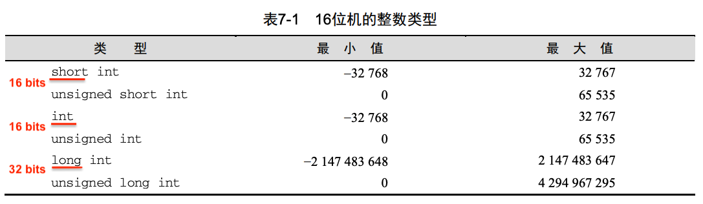
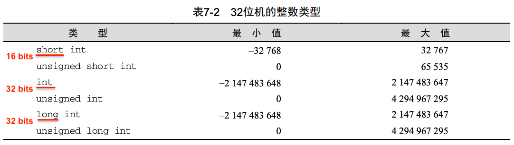
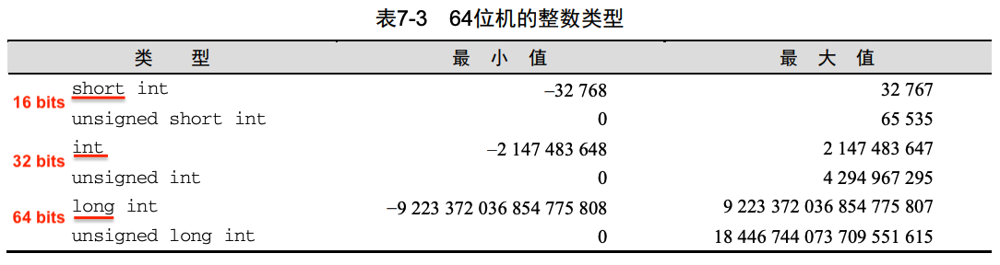
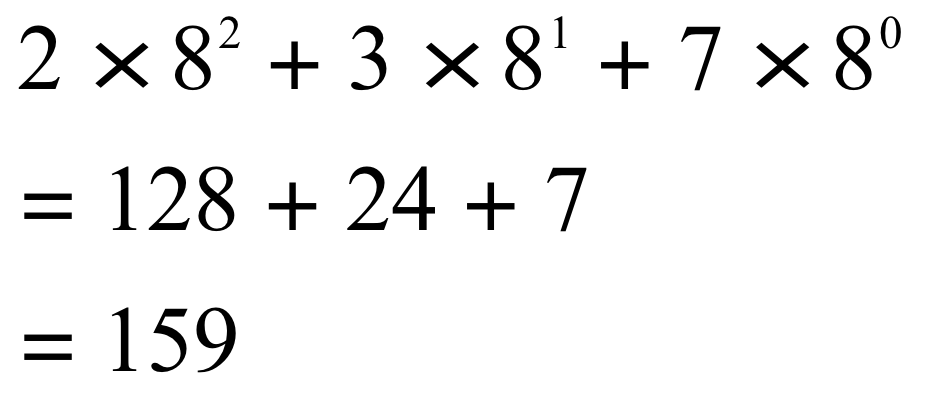
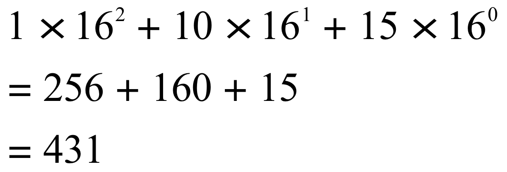

# 1. 学习建议

* 每节课之前都会把ppt和本周作业上传到超星学习通
  * 作业每个月上交一次（课代表）
  * 每一个章节都会有对应的练习题
* 上课做好笔记，不懂的地方随时前后翻看ppt或课本
* 每周4小时课程，每两周2小时上机时间
  * 上机时间可能不充足，在自己电脑上安装程序完成作业
* 学习代码，一定要注意细节，失之毫厘差之千里
* 所有代码，都要仔细亲手敲写，不要复制粘贴
* 作业题分为两种：
  * 练习题。阅读代码，判断其输出的结果。
    * 答案自检：可以通过代码写入程序，运行程序即可得到答案
  * 编程题。
* 对标国家计算机二级C语言考试，选择题40分，编程题60分。

# 2. C语言基本概念

```c
#include <stdio.h>
void main(){
  printf("Hello, Lvliang University.\n");
}
```

我们来梳理一下这个程序的内容结构：

```c
指令
void main(){
  语句s
}
```

* 指令：是程序在预处理时要完成的操作，指令都以#开头
  * `#include` 表示包含其他文件的内容信息
    * `#include <stdio.h>` 表示本程序文件“包含”了C语言的标准输入/输出库文件（stdio.h）的信息。
  * 其他指令：`#define` `#if #endif ...`
  * 指令的结尾没有分号，且必须独占一行

* 函数：又名方法，是用来构建程序的结构块。一个C程序其实是函数的集合，函数分为两大种类：一种是C语言所提供的标准库文件，是C语言的提供者已设计好的函数库，我们只需要引入这些文件就可以直接使用其中的函数；另一类是我们C语言的使用者自己写的函数（及函数集合）。

  * 术语“函数”来源于数学。在数学中，函数是指根据一个或多个给定参数进行一定运算的规则：f(x) = x +1和g(y, z) = y2 - z2。C语言的函数则更加宽泛，不一定必须有参数，也不一定要计算数值（其除了有运算的能力，还有执行其他命令的功能）。

  * 一个C程序可以包含很多函数，但只能有一个main函数，且必须有。main函数是所有程序文件的“主”函数，是程序执行的入口。

  * 函数的结构：

    * ```c
      返回类型 函数名(参数列表){
        声明
        语句
      }
      ```

    * 返回类型：是指每次调用此函数时，将返回的数据的类型

      * C语言提供的数据类型如图所示

    * 参数列表：是指要调用此函数时，需向函数提供的数据

    * 函数名：是一个函数的标识符号

    * 函数体：用花括号括起的部分是函数的函数体

      * 函数体中，声明语句必须放在最前面，然后是其他语句（C99之后允许变量在使用之前声明即可）

* 语句：是程序运行时执行的命令

  * 示例中只用到一种语句，就是在main函数体中的函数调用语句。这条语句调用了C语言的标准输入/输出库文件的printf函数，所以要在程序的预处理指令中引入该文件。
  * printf函数用于产生格式化输出。
    * printf函数中双引号括起来的部分称为格式串，格式串中的普通字符会被完整打印在终端
    * 格式串中\n是一个转义字符，其作用是使格式串输出之后换行
    * 字符：ascii码表
  * 语句s表示这里可以有多条语句，而实例中我们只写了一条语句
  * 语句的结尾都有分号

* 注释：注释用于对代码的功能作用做阐释，帮助程序的阅读者理解代码。注释不会程序执行。

  * 多行注释：/* */
  * 单行注释：//

### 变量、变量的类型和赋值

* 任何一种编程语言都需要有一些用于临时存储数据的方法，C语言中的这种存储单元叫变量。

* 每一个变量都必须有一个类型。

  * 类型用来说明变量所存储的数据的种类。
  * （图）
  * 类型决定了变量的存储方式以及允许对变量进行的操作。类型也决定了变量所能存储的数值的最大值和最小值，以及是否允许有小数点及之后的数字
  * 我们目前先介绍两种：int类型和float类型
    * int，是integer的缩写，表示整型，用于存储整数。比如：0、1、392、-2553
      * int类型的存储范围一般是-2147483648 ~ 2147483647
    * float，是floating-point的简写，表示浮点型，用于存储带小数位的数。比如：379.125
      * float类型的存储范围一般是`1.176*10^-38 ~ 3.403*10^38`，精度为小数点后6位。

* 声明：在使用变量之前，必须对其进行声明。首先指定变量的类型，然后要说明变量的名字。

  * ```c
    int height;
    float profit;
    //相同类型的变量，其声明可以放在同一条语句中: (每个变量是)
    int height, length, width, area;
    float profit, loss;
    ```

  * 声明语句必须放在其他语句之前。

    * C99后，允许变量只要在使用之前声明即可

* 赋值：变量声明只是确定了其存储数据的方式。变量要获得其值，需要经过赋值。

  * ```c
    height = 8;
    length = 12;
    profit = 1437.33f;
    ```

  * 像8，12，1437.33这样的值，这种不会被程序改变的值，我们称为常量。

  * 1437.33是一个浮点数，但编译器默认将它以double类型进行存储，即它是一个double类型常量

    * double类型，是双精度类型，精度为15位小数
    * 将一个高精度的数值，存储到一个低精度的变量中，可能会造成精度损失，所以如果是profit = 1437.33; 编译器会给我们一条警告信息，提示我们可能会造成精度损失。
    * 类似地，如果把一个double类型常量存入一个int类型变量中，也会造成精度损失，即使是height = 8.0; 编译器也会提醒我们，可能会造成精度损失——虽然实际上，这个例子并没有造成实际是精度损失。
    * 所以，要表示一个常量是float类型，那么要在这个数后面加f。

  * 变量的赋值或以其他方式使用之前必须先声明。

  * 在赋值语句中，等号的右侧不仅仅可以是一个常量，也可以是一个有值的变量，或一个更复杂的表达式。（表达式将在第n讲具体讲解）

* 变量的初始化：在变量声明之后，在使用它的值之前，我们必须要对变量进行一次初始化赋值。

  * 如果一个变量还没有经过初始化，就对它的值进行使用，会导致程序崩溃或得到没有意义的数值。

  * 一个好的习惯是：在变量声明时进行初始化

    * ```c
      int height = 8;
      //类型相同的变量可以写在同一条语句中:
      int width = 10, area = 80;
      ```

* 用printf函数显示变量的值：

  * ```c
    printf("the value of height is %d\n", height);
    ```

  * 格式串中，占位符%d，用来指明在显示过程中变量height的值所显示的位置。

  * %d仅用于int型变量。

  * 如果要显示float型变量，需要用%f来代替%d。默认情况下，%f会显示出小数点后6位数字。如果要强制%f显示小数点后p位数字，可以把.p放置在%和f之间。

    * ```c
      printf("Profit: $%.2f\n", profit);
      ```

    * 显示：Profit: $2150.48

  * 转义符\n用于使光标移动到下一行

* printf函数不仅可以显示变量的值，也可以显示表达式的值：

  * ```c
    printf("the value of area is %d\n", height * width);
    ```

* 读入输入：scanf是用于读取用户输入的函数。

  * ```c
    scanf("%d", &i);
    ```

  * 双引号内括起的部分是格式串，%d是占位符，d决定了输入的数值会被当做整数来存储，并存入变量i。

  * 取地址符&，用于获取变量i的地址。使用scanf函数读取变量，必须在变量前面加&。

  * 如果要读入一个float类型的数值，则要使用%f：

  * ```c
    scanf("%f", &profit);
    ```

### 标识符的命名规则

变量、函数、常量等实体都需要有一个名字，我们统称为这些实体的标识符。

* C语言的标识符可以包含字母、数字、下划线和$，但不能以数字开头。
* 不能使用C语言关键字
* C语言严格区分大小写

命名规约：

* 见名知意
* 函数和变量：小驼峰式
* 常量名：全字母大写

# 3. printf & scanf

```c
printf("格式串", 表达式1, 表达式2, ...);
```

- 函数printf来自标准输入/输出库文件(stdio.h)，可以产生格式化输出。

  - 如果想调用printf函数，必须在程序头部引入该文件(#include <stdio.h>)。

- printf函数被设计用来显示格式串的内容，并在串中指定位置插入可能的值。

- 必须提供格式串，格式串后面的参数可以是无限个。

格式串：

- 格式串包含普通字符和转换说明
- 转换说明以%开头（%字母，构成一个占位符）
- %后面的字母决定了数据以何种方式打印输出

表达式：

- 表达式可以是常量或变量，也可以是带有运算符的复杂表达式
- 在打印输出时，普通字符被简单复制，而转换说明则依次被表达式的值替换

常见转换说明：

* 转换说明可以用**%m.pX**格式或**%-m.pX**格式
  * m和p都是整数常量，X是字母
  * -，m，p是可选的。省略p时，其前面的.也要一起省略。
  * m指定要显示的最少字符数量，即最小字段宽度
    * 如果需要显示的字符少于m个，则值在字段内右对齐（即在值前面放置空格）
    * printf("%4d", 123); ---> _123
    * 如果需要显示的字符多于m个，则自动扩展到所需的尺寸（即值会被完整打印，不会丢失数字）
    * printf("%4d", 12345); ---> 12345
    * 在m之前放置负号(-)，会左对齐
    * printf("%4d", 123); ---> 123_
  * p指定精度。但其具体含义根据X的不同而不同。
    * d：p指定待显示的数字的最少个数（必要时前面额外加0），如果不写，默认值为1
      * 如果数字位数多于p，则全部打印
      * 如果数字的位数少于p，则在前面补0
    * e：p指定小数点后数字的个数，如果不写，默认值为6
    * f：p指定小数点后数字的个数，如果不写，默认值为6

|  d   | 整数十进制                            |  ld  | 整数long类型                         |
| :--: | ------------------------------------- | :--: | ------------------------------------ |
|  u   | (无符号)整数十进制                    |      |                                      |
|  o   | (无符号)整数八进制                    |      |                                      |
|  x   | (无符号)整数十六进制                  |      |                                      |
|  f   | 浮点数（默认保留6位小数）             |  lf  | 浮点数double类型（默认保留15位小数） |
|  c   | 字符                                  |      |                                      |
|  e   | 浮点数（科学计数法，默认保留6位小数） |      |                                      |
|  g   |                                       |      |                                      |
|  s   | 字符串                                |      |                                      |

> 科学记数法是一种记数的方法。把一个数表示成a与10的n次幂相乘的形式（1≤|a|<10，a不为分数形式，n为整数），这种记数法叫做**科学记数法。**

* 整数short类型：在d/u/o/x前加h。整数long类型：在d/u/o/x前加l。

* scanf函数：读取float用e，f，g。要读取double，要在前面加l。C99后，要读取long double，要在前面加L。

* printf函数输出float或double，都不需要加l或L，直接用e，f，g。

  > * 为什么？因为scanf和printf函数都有可变长度参数列表，编译器会对这种函数的float类型参数都自动转为double类型。结果是printf函数无法区分float类型和double类型。
  > * 另外，scanf函数是通过指针指向变量的，%f会告诉函数所传地址位置上存储着一个float类型值，%lf为double类型，如果给错转换说明，那么函数可能会存储错误的字节数量。

### printf例子：

```c
#include <stdio.h>
void main(){
  int i;
  float x;
  i = 40;
  x = 839.21f;
  printf("|%d|%5d|%-5d|%5.3d|\n", i, i, i, i);
  printf("|%10.3f|%10.3e|%-10f|\n", x, x, x);
}
```

* \n是转义字符，表示换行。
* 常量839.21在编译时默认为double类型，如果要强调它是float类型，需要在后面加f。
* （变量和常量的转换问题）

解释：

* %d —— 以十进制显示变量i，且占用最少的空间。
* %5d —— 以十进制显示变量i，且至少占用5个字符的空间。
  * 如果变量i少于5个字符，则右对齐，变量前加适量空格。
  * 如果变量i多于5个字符，则完整打印变量i。
* %-5d —— 以十进制显示变量i，且至少占用5个字符的空间，左对齐。
  * 如果变量i少于5个字符，则左对齐，变量后加适量空格。
  * 如果变量i多于5个字符，则完整打印变量i。
* %5.3d —— 以十进制显示变量i，且至少占用5个字符的空间，至少有3位数字。
  * 如果变量i多于3位数，则只完整打印变量i。
  * 如果变量i少于3位数，则在变量i前加适量的0。

* %10.3f —— 以定点十进制形式显示变量x，共用10个字符，小数点后3位。
  * 小数点后3位数字，占3个字符。小数点占1个字符
  * 如果变量x的整数部分多于6位数字，则完整打印变量x
  * 如果变量x的整数部分少于6位数字，则在数字前添加合适个数的0
  * 小数点后保留的数字，采用四舍五入

* %10.3e —— 以指数形式显示变量x，共占用10个字符，小数点后保留3位数字。
  * x.xxxe+nn
    * C的编译系统自动指定：小数部分占位6位，指数部分的占位5位或4位（e+nnn或e+nn）
  * 小数点后3位数字，占3个字符。小数点占1个字符。小数点前1位数字，占1个字符。（5）
  * e+占2个字符。e+后是一个两位数的整数，占2个字符。（4）
  * 所以这种表示方式，共占9个字符。
  * 需要在变量x前添加一个空格来占满10个字符。

### 转义符

* 格式串中经常用到一些有特殊含义的字符组合，我们称之为转义符。

| 转义字符 | 意义                                | ASCII码值（十进制） |
| :------: | ----------------------------------- | ------------------- |
|    \a    | 响铃(BEL)                           | 007                 |
|    \b    | 退格(BS) ，将当前位置移到前一列     | 008                 |
|    \f    | 换页(FF)，将当前位置移到下页开头    | 012                 |
|    \n    | 换行(LF) ，将当前位置移到下一行开头 | 010                 |
|    \r    | 回车(CR) ，将当前位置移到本行开头   | 013                 |
|    \t    | 水平制表(HT) （跳到下一个TAB位置）  | 009                 |
|    \v    | 垂直制表(VT)                        | 011                 |
|   `\\`   | 代表一个反斜线字符''\'              | 092                 |
|   `\'`   | 代表一个单引号（撇号）字符          | 039                 |
|   `\"`   | 代表一个双引号字符                  | 034                 |
|    \?    | 代表一个问号                        | 063                 |
|    \0    | 空字符(NUL)                         | 000                 |
|   \ddd   | 1到3位八进制数所代表的任意字符      | 三位八进制          |
|   \xhh   | 十六进制所代表的任意字符            | 两位十六进制        |

> 什么是字符，什么是字符串？

> 先展示部分转义符，第七章再讲完整的转义符

### scanf函数

* scanf函数用于格式化读取输入。

* scanf也必须提供格式串，且格式串也可以包含普通字符和转换说明。但在多数情况下，scanf的格式串，只包含转换说明即可。

```c
int i,j;
float x,y;
scanf("%d%d%f%f", &i, &j, &x, &y);
```

* 在使用scanf函数时必须检查转换说明的数量和对应变量的数量是否匹配，并且检查每个转换方式是否合适。
* 符号&是取地址符，一般情况下必须放在每个变量的前面，除非该变量是一个表示字符串的变量。
* 在使用scanf函数时，如果要读取多个数字，终端输入时可以在数字之间以空白字符作为间隔。
  * 空白字符：空格，\n，\t，\v，\f，\r。（6个）

> scanf的工作方法：
>
> * 对于格式串中的每个转换说明，scanf函数从输入的数据中定位适当的类型项（必要时跳过空格），然后开始读入数据，直到遇到不可能属于这一项的字符时停止。
> * 如果前面的转换说明读取成功，那么scanf会继续处理剩下的格式串内容；
> * 如果前一项不能成功读入，scanf会立即返回，不再查看格式串剩余的部分。
>
> 从起始位置其，scanf会跳过忽略空白字符（white-space character)，因此我们可以把数字放在同一行或分散在几行内输入
>
> * 空白字符：空格，\n，\t，\v，\f，\r。（6个）
>
> ```c
>   1
> -20  .3
>      -4.0e3
> //scanf会把它看做：空空1回-20空空.3回空空空-4.e3回
> ```
>
> * scanf读整数：先找正负号，再读取数字，直到遇到非数字时停止。
> * scanf读浮点数：先找正负号（可选），再读数字（可能包含小数点），再读一个指数（可选）。
>   * 读取浮点数时，%f，%e，%g可以互换，它们遵循相同规则。
> * scanf遇到不属于当前项的字符时，会把它放回原处，以便下一项或下一个scanf函数再次读入。
> * scanf会忽略最后的换行符\n，把它留给下一次scanf调用时，这个\n会是其读取的第一个字符。
>
> scanf格式串中的普通字符：
>
> * 格式串中如果有空白字符：scanf读取时，会重复读取空白字符，直到遇到非空白字符，把该空白字符放回原处。格式串中的空白字符可以和输入中的空白字符1 : (0~N)
> * 格式串中如果有非空白字符：scanf读取时，会将格式串的非空白字符和输入中的字符相比较
>   * 如果匹配，则扔掉。继续处理格式串。
>   * 如果不匹配，则把读取的字符放回原处，scanf异常退出。

# 4. 表达式

* 表达式是表示如何计算值的公式。

* 最简单的表达式是变量和常量。
  * 变量是程序运行时需要计算的值
  * 常量是不变的值

* 更加复杂的表达式是把运算符（operators）用于操作数（operands）的表达式。

运算符：

运算符是构建表达式的基本工具。

* 算术运算符：正负 + - * / % ++ -- 
* 关系运算符：>   <    >=   <=   ==    !=
* 逻辑运算符：

### 算数运算符 + - * / % ++ --

一元运算符指的是这个操作符只作用于一个操作数（或表达式）。

二元运算符指的是这个操作符作用于两个操作数（或表达式）。

%是取余运算符。10%3，即10除以3的余数。

* 运算符`+ - * /`允许操作数是整数或浮点数，也允许二者混用
  * （为什么能够混用？这里涉及到C语言的隐式类型转换知识）
  * int和float在一起运算时，编译器会把int转为float类型再进行计算，计算的结果当然也就是float类型。

* 运算符%只允许操作数是整数。如果两个操作数有一个不是整数，则编译失败。
* 如果`/`或`%`的右操作数为0，会导致系统的未定义行为（可能会有灾难性后果，但也可能侥幸只得到一个无意义的大数）。
* 如果`/`或`%`用于负操作数，比如，如果i或j是负数：
  * C89：i/j既可以向上取整，又可以向下取整；i%j的符号与具体实现有关
    * -9/7 == -1或-2；  -9%7 == -2或5
  * C99：i/j向零取整；i%j符号总与i相同
* 使用`/`时，如果左右操作数都是整数，那么系统会进行整数除法，即如果二者的商应该是一个小数，系统只会得到其整数的部分，而不会得到其小数的部分。
  * eg：3/2，系统计算的结果是1，而不是1.5

### 运算符的优先级和结合性

当一个表达式包含多个运算符时，其含义可能不是一目了然的。

* C语言允许所有表达式通过使用圆括号()来进行分组
  * i + k * j，可以根据目的换为：(i + k) * j 或 i + (k * j)
* 如果不使用圆括号，应该如何计算该值呢？
* C语言编译器会通过采用**运算符的优先级**规则，来解决这个问题。
* （配图，优先级高到低）

为了帮助理解，我们通过按运算符优先级从高到低的次序依次给子表达式添加圆括号，来理解编译器的计算方式：

* i + j * k  == i + (k * j)
* -i + -k == (-i) + (-k)
* +i + j / k == (+i) + (j / k)

如果一个表达式中包含多个相同优先级的运算符，则进一步考虑运算符的结合性来确定计算顺序：

* `+ - * / %` 都是左结合，即从左向右依次计算
  * i - j + k == (i - j) + k
  * i * j / k == (i * j) / k

* `+ -`是右结合，即从右向左依次运算
  * `- + i` == -(+i)

附录。

练习。

### 赋值运算符

求出表达式的值以后常常需要将其存储到变量中，以便将来使用。

C语言提供了**简单赋值运算符合符**（simple assignment）和**复合赋值运算符**（compound assignment）。

1. 简单赋值：

   * 格式为 v = e，把表达式e的值计算出来，并把值复制给v。v是变量，e可以是常量、变量、或更复杂的表达式。

   * 如果v和e的类型不同，那么赋值时，会把e的值转化为v的类型。

   * ```c
     int i;
     float f;
     i = 42.9f;  //i现在是42
     f = 33;    //f现在是33.0
     ```

   * 在许多编程语言中，赋值是语句，完成赋值任务就结束了。但在C语言中，赋值也是一个表达式，它会产生一个运算结果。

   * 赋值表达式的值，就是v = e运算后，赋值给v的值。即表达式 i = 42.9f; 的值为42，而不是42.9f。

   * 于是，多个赋值表达式串联在一起，是合法有效的

     * i = k = j = 0;
     * 赋值符号=的结合性是右结合。
     * 所以，i = (k = (j = 0));

2. 复合赋值：

   * 对于语句 i = i + 2; C语言提供了复合赋值运算符来简写这个语句：i += 2;

   * 复合赋值运算符还有：-= *= /= %=

     * v += e，v加e，并把结果保存在v中
     * v -= e，v减e，并把结果保存在v中
     * v *= e，v乘e，并把结果保存在v中
     * v /= e，v除e，并把结果保存在v中
     * v %= e，v模除e，并把结果保存在v中

     > 有时候如果v中有副作用，v += e 不完全等同于 v = v + e

   * 复合赋值运算符的结合性为右结合。

### 自增运算符和自减运算符

* 最常用于变量的运算是自增或自减。
  * i = i + 1;  或  i = i - 1;
  * i += 1; 或 i -= 1;
* 自增运算符++和自减运算符--可以更加简便地实现上述功能。
  * i++ 或 i-- （自增和自减运算符作为后缀使用）
  * ++i 或 --i （自增和自减运算符作为前缀使用）
* 作为前缀，eg：++i，表示i立刻自增1，我们可以直接使用自增后的i的值
* 作为后缀，eg：i++，表示我们先使用i的原值，i再自增1

### 运算符的优先级和结合性表

| 优先级 | 符号类型名称               | 符号             | 结合性 |
| ------ | -------------------------- | ---------------- | ------ |
| 1      | （后缀）自增、（后缀）自减 | ++ --            | 左结合 |
| 2      | （前缀）自增、（前缀）自减 | ++ --            | 右结合 |
|        | 一元正负号                 | + -              | 右结合 |
| 3      | 乘法类                     | * / %            | 左结合 |
| 4      | 加法类                     | + -              | 左结合 |
| 5      | 赋值                       | = *= /= %= += -= | 右结合 |

* 添加圆括号练习：a = b += c++ - d + --e / -f
  * a = b += (c++) - d + --e / -f
  * a = b += (c++) - d + (--e) / (-f)
    *  (c++) - d中，- 号左侧紧挨一个操作数，所以它必然是一个减号
  * a = b += (c++) - d + ((--e) / (-f))
  * a = b += (((c++) - d) + ((--e) / (-f)))
  * a = (b += (((c++) - d) + ((--e) / (-f))))

> 子表达式的求值顺序没有定义，除了含有&&和||，及逗号运算符的子表达式。
>
> * 当子表达式改变了某个操作数的值时，产生的结果可能会不一致。（**赋值运算符**）
>
> * ```c
>   a = 5;
>   c = (b = a + 2) - (a = 1);
>   ```
>
>   * 对于大多数编译器，c的值为7-1=6或3-1=2。（6或2）
>
> * 所以不要再子表达式中使用赋值运算符。
>
> * **自增自减运算符**也会改变操作数：
>
> * ```c
>   i = 2；
>   j = i * i++;
>   ```
>
>   * j的结果可能是4，也可能是6。

### 表达式语句

* 在C语言中，任何表达式都可以用作语句。

* 即不论表达式是什么类型，计算什么结果，我们都可以在其后面添加分号来将其转换成语句。

* 例如，表达式++i转换为语句就是：
  * ++i;
* 这条语句执行的结果是，i先自增，然后将产生的新值取出。
* 但是由于++i不在更长的表达式之中（没有赋值，也没有跟其他子表达式参与运算），所以这个值会被丢掉。
* 例如，语句 i + j + 1; 会计算出一个值，然后值被丢掉，而i和j和1本身都没有发生任何变化，所以说这样的语句是无意义的。

# 5. 选择语句

目前我们见过的语句有：

* return语句
* 表达式语句

C语言还有以下几种语句：

* 选择语句：if语句、switch语句——允许程序在一组选项中选择其中一项作为执行路径。

* 重复语句：while语句、do while语句、for语句——支持重复执行操作。
* 跳转语句：break语句、continue语句、goto语句，支持无条件地跳转到程序的某个位置。
  * return语句也属于这种
* 复合语句：把几条语句组合成为一条语句
* 空语句：不执行任何操作的语句

### 逻辑表达式

某些C语句需要检测表达式的值是”真“还是”假“，例如 i < j。

C语言用1表示真，用0表示假。

逻辑表达式中使用到的运算符有三种：

* 关系运算符：> < >= <=
* 判等运算符：== !=
* 逻辑运算符：!   &&  ||

逻辑表达式的结果均为0或1。

1. 关系运算符：> < >= <=
   * 关系表达式可以用于比较整数和浮点数，也允许比较混合类型的操作数。
     * eg：1 < 2.5 的结果为1，5.6 < 4 的结果为0
   * 关系运算符的优先级低于算数运算符，结合性为左结合
     * eg：i + j < k + 1 等价于 (i + j) < (k + 1)
   *  C语言中，i < j < k是合法的，其运算过程是：
     * (i < j) < k
     * (0或1) < k 
     * 所以说这种写法虽然合法，但可能并不符合我们的初衷
2. 判等运算符：==  !=
   * 判等运算符用于判断左右两个操作数是否相等。
   * 判等运算符的优先级低于关系运算符，结合性为左结合
     * eg：i < j == j < k 等价于 (i < j) == (j < k)
     * 只有==符号的左右两式同时为真或同时为假，结果才是真
3. 逻辑运算符：!   &&  ||
   * ! 是一元运算符，&&和||是二元运算符
   * 逻辑运算符会把任何非零值的操作数作为"真"值来处理
   * 会把任何零值操作数作为”假“值来处理
     * 零值：NULL，0，'\0'
   * 非：! 表达式
     * 如果表达式的值为0，则表达式的结果为1
   * 且：表达式1 && 表达式2
     * 如果表达式1和表达式2的值都为非零值，则表达式的结果为1
   * 或：表达式1 || 表达式2
     * 如果如果表达式1和表达式2之中有任何一个的值为非零值，则表达式的结果为1
   * 以上，除此之外的情况，结果均为0
   * 运算符&&和||对操作数具有短路属性，即如果通过计算前面的子表达式的值已经可以确定整个表达式的值，那么后面的子表达式将不会进行运算。
     * eg：( i != 0 ) && ( j / i > 0)
     * 这个表达式必须先计算i是否等于0，如果i等于0，则子表达式的值为0，整个逻辑与表达式的值已经可以确定其值为0，那么右边的 j / i > 0 将不会参与运算。
     * 如果 j / i > 0 进行运算，那么程序会执行一个除以0的运算，会导致系统的未定义行为。
   * 由于其短路属性，在&&和||的表达式中如果有子表达式为赋值表达式或自增自减表达式，它们就不一定总能被执行
     * i > 0 && ++j > 0
     * 如果i > 0的结果为假，那么++j就不会被执行

### if语句

if语句允许程序通过测试表达式的值从两种选项中选择一种来执行。

if语句的形式：

```c
if (表达式) 语句
```

* 表达式两边的圆括号是必须的。这里的语句是一条语句，而不是多条语句。

* 先计算表达式的值，如果其值为真，那么接着执行下面的语句

  * 在if语句的表达式中经常犯的错误是：把==错写成=，赋值表达式也会产生一个值，所以这种写法没有错误，可以通过编译，但会导致我们得不到想要的执行过程。所以要主动检查这里所使用的符号。

  * 判断某一个变量是否落在某个数值范围内：

    ```c
    //如果i在[0,n]之间：
    if(0 <= i && i <= n) ...
    //与之相反：
    if(i <= 0 || i >= n) ...
    ```

#### 复合语句

复合语句是用一组花括号内包含一组语句，这样可以强制编译器将其作为一条语句来处理。

```c
{
	line_num = 0; 
	page_num++;
}
```

* 注意，复合语句内部的语句都是分号结尾，但复合语句本身却不是
* 复合语句可以用在任何C语言要求只能有一条语句的地方

比如，if语句使用复合语句：

```c
if(0 <= i && i <= n){
  i++;
  n--;
}
```

### if的else子句

if语句可以有else子句：

```c
if(表达式)语句 else 语句
```

* 如果表达式的值为0，则执行else后边的语句

* if和else的排布：

  * ```c
    if(i>j) max = i;
    else max = j;
    ```

  * ```c
    if(i>j)
      max = i;
    else
      max = j;
    ```

* if语句的内部语句，也可以是一个if语句：

  * ```c
    if(i>j)
      if(j>k)
        max = i
      else
        max = k;
    else
      if(j>k)
        max = j;
    	else 
        max = k;
    ```

  * if语句可以嵌套任意层

  * 为了方便阅读，我们可以给内部嵌套的if语句加上花括号。而增加适当的花括号，不仅便于程序阅读，更有利于修改代码。

### 级联式if-else语句

有时候我们需要判定一系列条件，一旦某个条件为真就立刻停止。

比如：用if语句判断n是小于0，还是等于0，还是大于0。

```c
if(n<0)
  printf("n<0");
else
  if(n==0)
    printf("n=0");
	else
    printf("n>0");
```

这种语句，有一个更加优化的书写形式：

```c
if(表达式)
  语句
else if(表达式)
  语句
...
else if(表达式)
  语句
else
  语句
```

这种缩进式的级联if语句可以避免判定数量较多时过多缩进的问题。

### 悬空else语句

注意：else子句总是属于离它最近的且还未被其他else子句匹配的if语句。

```c
if(y!=0)
  if(x!=0)
    result = y/x;
else
  printf("Error.");
```

* 这里的else子句属于内层if语句
* 如果想实现我们想要的效果，可以加上花括号

```c
if(y!=0){
  if(x!=0)
    result = y/x;
}else
  printf("Correct.");
```

### 条件表达式

if语句使我们可以根据条件判断的结果来执行两个操作中的一个。

C语言还提供了一种特殊的运算符，允许我们根据条件判断来选择产生两个值中的一个值。

条件运算符（三元运算符）：表达式1? 表达式2 : 表达式3

* 三个表达式可以是任意类型的表达式
* 如果表达式1成立，则返回表达式2的值。如果表达式1不成立，则返回表达式3的值。

* ```c
  i > j? i : j
  ```

* 条件运算符的优先级高于赋值运算符，低于目前介绍过的其他运算符。结合性为右结合。

如果条件表达式是int和float类型混合使用的，比如 (i > 0? i : f)，那么整个表达式的类型会被自动转化为float类型。如果i > 0，那么表达式的值为i的float值。

### switch语句

日常编程中，我们常常需要把表达式和一系列值进行比较，从中找到匹配的值，然后执行相应的操作。

级联式if语句可以达到这个目的。

但switch语句是一种精简的方式：

```c
switch(表达式){
	case 常量表达式 : 语句s
  ...
  case 常量表达式 : 语句s
  default : 语句s
}
```

* switch语句的执行过程：

  * 先计算表达式的值，然后将表达式的值逐个与case后的常量表达式的值相比，若其中一个相等，则执行该常量表达式后面的语句。
  * 第一次判断相等后，switch语句不再进行判断，继续执行后面所有case后的语句。（switch语句的“下漏”特性）
  * 如果表达式的值与所有case的常量表达式的值不匹配，则执行default语句，如果没有default语句，则跳出，执行switch语句之后的程序。

* switch语句注意事项：

  * 圆括号内的表达式：必须是整型表达式（即表达式的值必须是整数类型）
    * C语言把字符(char类型)当做整数来处理，所以该表达式也可以是一个字符
    * 但不能是浮点数或字符串

  * 常量表达式：是不能包含变量和函数调用的表达式，其值必须也是整数（字符也可以）

  * 语句s：每个case分支后边的语句，可以是任意数量个语句，无需使用花括号括起。这里也可以没有语句。

  * ```c
    switch(grade){
      case 4:
      case 3:
      case 2:
      case 1: printf("Passing"); printf("_");
      case 0: printf("Failing");
      default: printf("Illegal grade");
    }
    ```

    * 如果grade的值为4，终端会输出：Passing_FailingIllegal grade
    * 如果grade的值为0，终端会输出：FailingIllegal grade
    * 如果grade的值为5，终端会输出：Illegal grade

  * switch语句的分支标号不能重复，但对分支顺序没有要求，特别是default语句不一定非要放在最后一个，也可以放在第一个。default语句不是一定要有的。

### break语句

break语句可以使程序跳出switch语句。

```c
switch(grade){
  case 4:
  case 3:
  case 2:
  case 1: printf("Passing"); printf("_"); break;
  case 0: printf("Failing"); break;
  default: printf("Illegal grade");
}
```

* 如果grade的值为4，终端会输出：Passing_
* 如果grade的值为0，终端会输出：Failing
* 如果grade的值为5，终端会输出：Illegal grade

# 6. 循环

循环是重复执行循环体的一种语句。

所有的循环语句都有一个控制表达式，在每次执行循环体之前都要先对控制表达式求值

* 如果值为真，则执行循环体，然后再判断
* 如果值为假，则不执行循环体

C语言中3种循环语句：

* while语句：在执行循环体之前进行判断
* do while语句：先执行一次循环体，再进行判断
* for语句

### while语句

```
while(表达式) 语句
```

* 圆括号内的表达式是控制表达式
* 语句只能是一条。如果需要执行多条语句，使用花括号使其变成复合语句。

* while语句执行过程：

  * 先计算控制表达式的值，值为真则执行循环体
  * 然后再次计算控制表达式的值，值为真则继续执行……
  * 直至计算到控制表达式的值为假，则循环终止，while语句执行结束
    * 所以有的while语句，很可能一次都不执行，因为控制表达式第一次判断就为假

* 如果控制表达式的值始终为非零，则while语句将无法终止。

  * ```c
    while(1)...
    ```

### do while语句

```c
do 语句 while(表达式);
```

* do while语句和while语句唯一的区别就是，do while语句至少先执行一次循环体

* 语句必须是一条，可以是复合语句

  * 但最好给语句加上花括号，否则让人不容易察觉这是do while语句

  * ```c
    do
      printf("%d\n", i--);
    while(n>0);
    ```

* 注意do while语句最后有分号

### for语句

for语句适合使用变量计数来控制循环的次数。

```c
for(表达式1;表达式2;表达式3) 语句
```

一个例子：

```c
for(i=10; i>0; i--)
  printf("i is %d now\n", i);
```

for语句的执行步骤：

* 变量i先初始化为10，接着判定i是否大于0，
* 如果判定结果为真，则执行循环体语句，然后变量i自减。然后再次判定i是否大于0，如果判定为真，则继续执行循环体语句，变量i自减……
* 如果判定结果为假，则循环结束，不再执行循环体语句
* 这个例子，循环体一共被执行了10次，过程中变量i从10变化到1

其实绝大部分情况下，for语句总可以和等价的while语句互相替换：

```c
表达式1;
while(表达式2){
  语句
  表达式3;
}
```

* 表达式1是开始循环前的初始化步骤，只执行一次
* 表达式2是用来控制循环的终止（只要表达式2的值不为零，循环就继续执行）
* 表达式3是每一次循环中最后被执行的一个操作，用于促进表达式的值趋于0（但不是强制要求的）

for循环的惯用法：

1. 从0加到n-1
2. 从1加到n
3. 从n-1减到0
4. 从n减到1

```c
for(i=0; i<n; i++)...
for(i=0; i<=n; i++)...
for(i=n-1; i>=0; i--)...
for(i=n; i>0; i--)...
```

在for语句中省略表达式：

* C语言允许省略任意或全部的表达式

* 省略任何表达式时，for循环圆括号内的两个分号必须始终保留

* 省略表达式1，那么for语句不执行初始化操作，这意味着需要确保for循环前面的语句已经对变量i完成了初始化操作

  * ```c
    i = 10;
    for(; i > 0; i--)
      printf("i is %d now\n", i);
    ```

* 省略表达式3，那么需要注意在for语句的其他地方能够确保表达式2的值最终会变成0

  * ```c
    for(i = 10; i > 0; )
      printf("i is %d now\n", i--);
    ```

* 同时省略表达式1和表达式3时，这个for语句就和while语句没有任何区别了

* 如果省略表达式2，那么它默认为真值，因此for语句不会终止（除非以其他方式对它停止）

  * 一个无限循环语句：

  * ```c
    for(;;)...
    ```

> 在C99中，由于其允许变量的声明在使用时才进行，所以for语句可以写为：
>
> ```c
> for(int i = 10; i > 0; i--)...
> ```
>
> * 这种写法非常灵活，这里创建的变量i是一个新建的变量且仅存在于for语句内部，即如果前面已经定义过一个变量i，它与for循环中的变量i不是同一个变量，因而也不会发生冲突。
>

for语句的表达式1也可以声明多个变量，只要它们类型相同：

```c
for(int i = 0, j =0; i < n; i++)...
```

for语句对其三个表达式没有任何限制，虽然在使用时我们通常会对同一个变量进行初始化、判定和更新，但它们之间也可以没有任何关联：

```c
#include <stdio.h>
void main(){
    int i, odd, square;
    i = 1;
    odd = 3;
    for(square = 1; i <= 10; odd += 2){
      printf("%10d%10d\n", i, square);
      ++i;
      square += odd;
    }
}
```

* 本程序会输出每一个i所对应的平方数square

### 逗号表达式

逗号表达式允许将两个表达式“粘贴”在一起构成一个表达式。

* 注意：复合语句与之类似，它允许我们将一组语句当做一条语句来使用。

逗号表达式的形式：

```c
表达式1, 表达式2
```

* 逗号表达式的计算步骤：

  * 先计算表达式1的值，然后扔掉
  * 再计算表达式2的值，然后将表达式2的值作为整个表达式的值
  * eg：++i, i + j; 的运算过程是：变量i先自增1，然后计算i+j的值，然后把i+j的值作为表达式的值

* 也可以把多个逗号表达式嵌套在一起，达到的效果就是将一些表达式“粘贴”在一起

  ```c
  表达式1, 表达式2, 表达式3, ...
  ```

* 逗号运算符的优先级最低，结合性为左结合

### 跳出循环

* break语句，相当于在循环体内放置退出点
* continue语句，会跳过某次循环的部分内容，开始执行下一次循环，但不会跳出整个循环
* goto语句，允许程序从一条语句跳转到另一条语句（我们很少使用）

break语句：

* 我们曾用它跳出switch语句

* 它也可以跳出while语句，do while语句和for语句

* ```c
  //测试数字n是否为素数:
  for(d = 2; d < n; d++)
  	if(n % d == 0)
      break;
  if(d < n)
    printf("%d能被%d整除.\n", n, d);
  else
    printf("%d是素数.\n", n);
  ```

* break语句只能向上跳出一层循环

  * ```c
    while(...){
      switch(...){
          ...
          break;
          ...
      }
    }
    ```

  * 这里的break只能跳出switch语句，不能跳出while语句

continue语句：

* break语句会把程序控制转移到循环体末尾之后，而continue语句会把程序控制转移到循环体末尾之前

* break语句可以用于循环语句（while，do while，for）和switch语句，而continue语句只能用于循环语句

* continue语句只是跳过本次循环的剩余部分，但仍在循环语句内，break则直接跳出了循环语句

* ```c
  //向程序输入10次数字，并将这些数字相加
  n = 0, sum = 0;
  while(n < 10){
    scanf("%d",&i);
    if(i==0)
      continue; 
    sum += i;
    n++;
    /* continue jumps to here */
  }
  ```

goto语句：

* goto语句会把程序控制转移到函数中任何有标号的语句处

* ```c
  标识符 : 语句
  goto 标识符;
  ```

* ```c
  //使用goto代替break
  for(d = 2; d < n; d++)
    if(n % d == 0)
      goto done;
  done:
  if(d < n)
    printf("%d能被%d整除.\n", n, d);
  else
    printf("%d是素数.\n", n);
  ```

### 空语句

* 语句可以为空，即只有末尾的分号，其余什么符号都没有。

* 比如：i = 0; ; j = 1;

* 使用空语句时，建议令其独占一行，以免造成阅读困难：

  ```c
  for(d = 2; d < n && n % d != 0; d++)
    ;
  ```

  而不是

  ```c
  for(d = 2; d < n && n % d != 0; d++);
  ```

# 7. 基本数据类型

### 7.1 整数类型：

* C语言的整数类型有不同的尺寸。

  * int类型通常为32位，但在老的CPU上可能是16位。
  * 有些程序所使用的数值很大，无法以int类型存储，所以C语言还提供了**长整型（long integer)**。
  * 某些时候，为了节省空间，我们会需要编译器以比正常小的存储空间来存储一些数值，这就是**短整型（short integer)**。

* 为了使构造的整数类型正好满足需要，可以指明变量是long类型或普通int类型或short类型，singed类型或unsigned类型，这样我们就拥有了6种不同的整数类型：

  |        类型        |        简写        |
  | :----------------: | :----------------: |
  |     short int      |     **short**      |
  | unsigned short int | **unsigned short** |
  |        int         |      **int**       |
  |    unsigned int    |  **unsigend int**  |
  |      long int      |      **long**      |
  | unsigned long int  | **unsigned long**  |

  * 可以省掉int来缩写整数类型
  * 6种整数类型的取值范围都会根据机器的不同而不同，但标准要求int类型不能比short类型短， long类型不能比int类型短。（**long >= int >= short**)

* 各整数类型取值范围：

  

  

  

  * 以上三张表中给出的取值范围不是C标准强制的，会随着编译器的不同而不同（C语言的方言）。
  * 如果想要自己所用的编译器对以上六种整数类型范围的定义，可以检查一个名为<limits.h>的头文件。 该头是标准库的一部分，其中定义了表示每种整数类型的最大值和最小值。

* 整数常量：

  * C语言允许用十进制（基数为10）、八进制（基数为8）和十六进制（基数为16）形式书写整数常量。

  * 八进制数：是用数字0~7书写的。

    * 八进制数的每一位表示一个8的幂（这就如同十进制数的每 一位表示10的幂一样）。

    * 因此，八进制数 237 表示成十进制数就是：

      

  * 十六进制数：是用数字0~9加上字母A~F书写的，其中字母A~F表示10~15的数。

    * 十六进制数的每一位表示一个16的幂，

    * 十六进制数 1AF 的十进制数值是：

      

  * 十进制常量包含0~9中的数字，但是一定不能以0开头：15，255，32767
  * 八进制常量只包含0~7中的数字，而且必须要以0开头：017，0377，077777
  * 十六进制常量包含0~9中的数字和a~f中的字母，而且总是以0x开头：0xf，0xff， 0x7fff
    * 十六进制常量中的字母a-f和x既可以是大写也可以是小写：0xff，0xfF，0xFf，0xFF，0Xff，0XfF，0XFf，0XFF
  * 记住：八进制和十六进制只是书写数的方式，它们不会对数的实际存储方式产生影响（整数在计算机中都是以二进制形式存储的，跟表示方式无关）。任何时候都可以从一种书写方式切换到另一种书写方式，甚至可以混合使用：10 + 015 + 0x20的值为55（十进制）。
  * 十进制整数常量的类型通常为int。但如果常量的值过大，大到int类型无法存储，编译器就会使用long类型来存储它。如果long类型还不够存储，就使用unsigned long来尝试存储。
  * 而面对八进制数或十六进制数，编译器会依次尝试使用int、unsigned int、long和unsigned long来存储其值，在找到合适的类型时，就不会继续使用更占内存的方式来存储了。
  * 有时候，我们需要强制使编译器把一个数字按long类型来存储/读入程序，那么我们需要在这个常量后边加上字母L或l：
    * 15L，0377L，0x7fffL
  * 如果我们需要让编译器把一个数字按无符号类型来存储，我们需要在这个常量后边加上字母U或u：
    * 15U，0377U，0x7fffU
  * 如果一个数字，既要是long类型，又要无符号，则在常量后边加上U和L：0xffffffffUL。（L和U的顺序、大小写都无所谓。）

* 整数溢出：

  * 对整数进行算术运算时，其结果有可能因为太大而无法表示。例如，对两个int值进行算术运算时，其结果当然也是用int类型来表示；但如果结果的数值过大，就会发生溢出。
  * 如果整数溢出：
    * 有符号的整数，会产生未定义行为：得到一个无意义的数字，或程序崩溃
    * 无符号的整数，会对2^n取模

* 读/写整数：

  * 很多时候我们需要考虑和提前应对整数溢出的情况，主要是以下三种：

    * 如果两个整数做算数运算，可能会导致整数溢出，那么把这两个整数变为long类型：30000L + 20000L
    * 在scanf函数的调用语句中，如果我们使用%d来接收一个大于22亿的数值，那么会导致我们实际上读取到一个无意义的数字，或scanf函数异常退出（那么没有读到数字），或程序崩溃退出。
    * 在printf函数的调用语句中，如果我们想要输出一个大于22亿的数值，使用%d一定不能准确输出这个数值。

  * 在读写整数的时候，我们要根据情况来使用合适的占位字符：

    * 读写int类型整数：%d

    * 读写无符号的整数：%u，%o（无符号八进制），%x（无符号十六进制）

    * 读写short类型整数：在d/u/o/x前加h

      * %hd，%hu，%ho，%hx

    * 读写long类型整数：在d/u/o/x前加l

      * %ld，%lu，%lo，%lx

    * > 注意：以上字母，全部必须是小写

  * 例如：

    ```c
    This program sums a series of integers.
    Enter integers (0 to terminate): 10000 20000 30000 0
    The sum is: -5536
    ```

    改进：

    ```c
    long n, sum = 0;
    scanf("%ld", &n);
    printf("The sum is: %ld\n", sum);
    ```

    

### 7.2 浮点类型


# 8. 数组

* 到目前为止，我们见过的变量都只能保存一个数据，这种变量我们统称为标量（scalar）。
* 而有的变量，允许我们存储一组值，我们称之为聚合（aggregate）变量。
* C语言中一共有两种聚合类型：数组（array）和结构（structure）。

数组：

* 数组是含有多个数据值的数据结构，并且每个数据值具有相同的数据类型。

  * 其中每一个数据，称为元素
  * 数组的元素可以通过它们在数组中的位置来一个个地选出来

* 一维数组：（图）

  * 声明：

    * ```c
      int a[10];
      ```

    * 数组的元素可以是任何类型，数组的长度可以用任何（整数）常量表达式指定

  * 数组的索引（下标）：用于方便存取特定的数组元素

    * 数组元素的索引始终从0开始，到n-1（假设数组长度为n）

  * 所有数组元素也可以像普通变量一样使用：

    ```c
    a[0] = 1;
    printf("%d\n", a[5]);
    ++a[i];
    ```

  * 对数组的常用操作：

    * 清除数组a的元素值为0

      ```c
      for (i = 0; i < N; i++)
        a[i] = 0;
      ```

    * 为数组a的所有元素读取数值

      ```c
      for (i = 0; i < N; i++)
        scanf("%d", &a[i]);
      ```

    * 求所有元素之和

      ```c
      for (i = 0; i < N; i++)
        sum += a[i]; 
      ```

  * C语言不要求检查下标的范围。当下标超出范围时，程序可能执行不可预知的行 为。

  * 数组下标可以是任何整数表达式：

    ```c
    a[i+j*10] = 0; 
    a[i++] = 0; 
    ```

  * 数组元素的初始化：像其他变量一样，数组元素在使用之前必须要初始化，即赋予它一个有效的值。

    * 最简单的初始化式是用大括号括起来的常量表达式列表，常量表达式之间用逗号进行分隔：

    ```c
    int a[10] = {1, 2, 3, 4, 5, 6, 7, 8, 9, 10};
    
    /* 初始化式可以比数组长度短，那么剩余元素被赋值为0 */
    int a[10] = {1, 2, 3, 4, 5, 6};//数组a被初始化为{1, 2, 3, 4, 5, 6, 0, 0, 0, 0}
    int a[10] = {0};
    
    /* 有初始化式，就可以省略数组长度 */
    int a[] = {1, 2, 3, 4, 5, 6, 7, 8, 9, 10}; 
    ```

    * 其次是用for循环遍历数组元素，初始化每一个元素：

    ```c
    for(i=0; i<sizeof(a)/sizeof(a[0]); i++)
      a[i] = 0;
    ```

* 多维数组：

  * 数组可以有任意维数。

  * 声明一个二维数组（数学上称为矩阵）：`int m[5][9]`
    
  * 这个数组有5行9列，即它包含5个元素，每个元素都是一个一维数组（包含9个元素）。
    
  * 数组的访问：`m[4][8]` `

  * 多维数组初始化：

    * 二维数组初始化式：嵌套一维数组的初始化式

      * ```c
        int m[5][9] = {{1, 1, 1, 1, 1, 0, 1, 1, 1},
                       {0, 1, 0, 1, 0, 1, 0, 1, 0},
                       {0, 1, 0, 1, 1, 0, 0, 1, 0},
                       {1, 1, 0, 1, 0, 0, 0, 1, 0},
                       {1, 1, 0, 1, 0, 0, 1, 1, 1}}; 
        ```

    * 初始化式缩写方式：

      * ```c
        //只填充前三行，后两行自动初始化为0
        int m[5][9] = {{1, 1, 1, 1, 1, 0, 1, 1, 1},
                       {0, 1, 0, 1, 0, 1, 0, 1, 0},
                       {0, 1, 0, 1, 1, 0, 0, 1, 0}};
        
        //内层初始化式也可以省略，不必全部填满，剩余的元素初始化为0
        int m[5][9] = {{1, 1, 1, 1, 1, 0, 1, 1, 1},
                       {0, 1, 0, 1, },
                       {0, 1, 0, 1, 1, 0, 0, 1},
                       {1},
                       {1, 1, 0, 1, 0, 0, 1, 1, 1}};
        
        //甚至可以省略掉内层的花括号：一旦编译器发现数值足以填满一行，它就开始填充下一行。
        int m[5][9] = {1, 1, 1, 1, 1, 0, 1, 1, 1,
                       0, 1, 0, 1, 0, 1, 0, 1, 0,
                       0, 1, 0, 1, 1, 0, 0, 1, 0,
                       1, 1, 0, 1, 0, 0, 0, 1, 0,
                       1, 1, 0, 1, 0, 0, 1, 1, 1};
        ```

* 数组下标越界：在 C 语言中，数组必须是静态的。换而言之，数组的大小必须在程序运行前就确定下来。由于 C 语言并不具有类似 [Java](http://c.biancheng.net/java/) 等语言中现有的静态分析工具的功能，可以对程序中数组下标取值范围进行严格检查，一旦发现数组上溢或下溢，都会因抛出异常而终止程序。也就是说，C 语言并不检验数组边界，数组的两端都有可能越界，从而使其他变量的数据甚至程序代码被破坏。

  因此，数组下标的取值范围只能预先推断一个值来确定数组的维数，而检验数组的边界是程序员的职责。

# 9. 函数

在C语言中，函数不一定要有参数，也不一定要计算数值。

函数是C程序的构建块。每个函数本质上是一个自带声明和语句的小程序。

函数可以复用：功能重复的代码，可以把重复部分单独写为一个函数。

从结构化编程的角度看，写函数的基本要求：

* 完成一个功能
* 只完成一个功能
* 没有任何错误地只完成一个功能

从结构上看，每个函数都是一个完整的程序，因为一个程序的核心构成，就是输入、处理、输出：

* 输入：接收外部通过参数传递的值
* 处理：执行特定的任务，得到输出结果
* 输出：向外部输送返回值

### 函数的定义和调用

一个简单的函数：

```c
double average(double a, double b){
   return (a + b) / 2;
}
```

* 函数的返回类型：double

* 函数的参数列表：double a, double b

  * a和b是函数的形式参数，表示在调用average函数时需要提供的两个数
  * 每个形式参数必须有类型
  * 函数的形参本质上就是变量，其初始值在函数被调用时才提供

* 函数体：{ return  (a + b) / 2; }

  * return语句：会使程序“返回”到调用它的地方，表达式 (a+b)/2的值将作为函数的返回值。

* 函数的调用：average(5.2, 3.0)

  * 调用函数时，需要写出函数名及跟随其后的实际参数。

  * 实际参数不一定要是常量，任何正确类型的表达式都可以。

  * 函数调用可以放在任何需要使用其返回值的地方。

    * 比如：printf("Average: %f\n", average(x, y));

    * 这条语句产生如下效果：

      (1) 以变量x和y作为实际参数调用average函数。

      (2) 把x和y的值复制给a和b。

      (3) average函数执行自己的return语句，返回a和b的平均值。

      (4) printf函数显示出函数average的返回值。（average函数的返回值成为了函数printf 的一个实际参数。）

      * 注意：我们没有保存average函数的返回值，程序显示这个值后就把它丢弃了。

      * 如果需要 在稍后的程序中用到返回值，可以把这个返回值赋值给变量： avg = average(x, y); 

函数的定义：

```c
返回类型 函数名 (形式参数){
		声明
 		语句
} 
```

* 返回类型的规则：
  * 函数不能返回数组。
  * void类型说明函数没有返回值。
  * 如果省略返回类型，C89会假定函数返回值的类型是int类型，C99则不允许这种情况（这样做不合法）。

* 参数列表规则：
  * 需要在每个形式参数的前面说明其类型，形式参数间用逗号进行分隔。
* 函数体：
  * 函数体内声明的变量专属于此函数，其他函数不能对这些变量进行检查或修改。
  * 在C89中，变 量声明必须出现在语句之前。
  * 函数体可以为空。
  * 一般来说，在 一个函数中可以声明与另一个函数中的变量同名的变量。这两个变量在内存中的地址不同，所 以给其中一个变量赋新值不会影响另一个变量。（形式参数也具有这一性质。）
  * 函数可以有多条return语句。但是，在任何一次函数调用中只能执 行其中一条return语句，这是因为到达return语句后函数就会返回到调用点。

函数调用：

* 函数调用由函数名和跟随其后的实际参数列表组成，其中实际参数列表用圆括号括起来：

  * ```c
    average(x, y); 
    print_count(i); 
    print_pun();
    ```

### 函数声明

* 在很多程序中，函数的定义总是放置在调用点的上面。事实上，C语言并没有要求函数的定义必须放置在调用点之前，实际上这样很难总是做到（比如有的函数是互相调用）。

* 在一个函数中，如果编译器遇到了另一个没有见过的函数，编译器不知道这个函数有多少形式参数，形式参数的类型是什么，也不知道函数的返回值是什么类型，编译器不会给出出错消息，而是假设这个函数的返回类型是int（这个过程称为隐式声明）。

* 当编译器在后面遇到这个函数定义时，它发现函数的返回类型实际上是double而不是int，那么我们会得到一条出错消息。

* 为了避免这种问题，C语言提供了一种更好的解决办法：在调用前声明每个函数。

* 函数声明（function declaration）使得编译器可以先对函数进行概要浏览，而函数的完整定义以后再给出。

  ```c
  返回类型 函数名 (形式参数);
  ```

  * 函数的声明必须与函数的定义一致。

    ```c
    #include <stdio.h>
    double average(double a, double b); /* average函数声明 */
    void main(){
       double x, y, z;
       printf("Enter three numbers: ");
       scanf("%lf%lf%lf", &x, &y, &z);
       printf("Average of %g and %g: %g\n", x, y, average(x, y));
       printf("Average of %g and %g: %g\n", y, z, average(y, z));
       printf("Average of %g and %g: %g\n", x, z, average(x, z));
    }
    double average(double a, double b){ /* average函数定义 */
     	 return (a + b) / 2;
    }
    ```

    * 我们可以称这种函数声明为函数原型（function prototype）。

    * 函数原型也可以不说明函数形式参数的名字，只要显示它们的类型就可以：

      ```c
      double average(double, double);
      ```

      * 通常最好是不要省略形式参数的名字，因为这些名字可以说明每个形式参数的目的，并且提醒 程序员在函数调用时实际参数的出现次序。

    * C99遵循这样的规则：在调用一个函数之前，必须先对其进行声明或定义。调用函数 时，如果此前编译器未见到该函数的声明或定义，会导致出错。

### 实际参数

* 形式参数（parameter）：出现在函数定义中，它 们以假名字来表示函数调用时需要提供的值。
* 实际参数（argument）：是出现在函数调用中的表达式。

* 在C语言中，实际参数是通过值传递的：调用函数时，计算出每个实际参数的值并且把它赋值给相应的形式参数。在函数执行过程中，对形式参数的改变不会影响实际参数的值，这是 因为形式参数中包含的是实际参数值的副本。

* 实际参数的转换：C语言允许在实际参数的类型与形式参数的类型不匹配的情况下进行函数调用。

  * 如果函数在被调用前已提供了原型：就像使用赋值一样，每个实际参数的值被隐式地转换成相应 形式参数的类型。

  * 如果函数在被调用前没有提供了原型：编译器执行默认的实际参数提升。

    （1）把float类型的实际参数转换成double类型

    （2）把char类型和short类型的实际参数转换成int类型

  * 保持好的习惯：提前做好函数声明，以免不必要的错误发生

### return语句

```c
return 表达式;
```

* 表达式可以是常量、变量或更复杂的表达式：

  ```c
  return 0;
  return status;
  return n >= 0 ? n : 0;
  ```

  * 类型不匹配：如果return语句中表达式的类型和函数的返回类型不匹配，那么系统将会把表达式的类型 隐式转换成返回类型。

* 非void函数必须有return语句，如果没有，当程序到达了函数体的末尾（也就是说没有执行return语句），那么如果程序试图使用函数的返回值，其行为是未定义的（可能会导致程序崩溃）。

### 程序终止

* main是函数，那么它必须有返回类型。
* 以往的C程序常常省略main的返回类型，因为C89给未写返回类型的函数默认提供int类型的返回方式。

* main函数返回的值是状态码，在某些操作系统中程序终止时可以检测到状态码。
  * 正常终止：0
  * 异常终止：非0 （不同的值有不同意义）

* 在main函数中执行return语句是终止程序的一种方法，但是还有其他方法：是调用exit函数，此函数属于<stdlib.h>头文件。
  * exit(0); 正常终止
  * exit(EXIT_SUCCESS); 正常终止
  * exit(EXIT_FAILURE);  异常终止

* `return 表达式; ` 等价于 `exit(表达式); `
  * 不同是：不管哪个函数调用exit函数都会导致程序终止，return语句仅当由main函数调用时才会导致程序终止。

# 遗留：递归函数，变量作用域


# 课件不足：

* 编程语言入门讲解，还是不够清晰具体